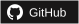

  <picture>
    <source media="(prefers-reduced-motion: reduce)" srcset="assets/sunlit-study.png">
    
  </picture>

<h1 align="center"><samp>Hi! I'm Fanglei Liu.</samp> 👋</h1>

  <strong>可信 AI · 检索增强生成 · 大模型评估 · 科研软件</strong> 
  计算机硕士（Master of Computing）· 澳大利亚国立大学（ANU）

  
  
  
  

---

## 👋 关于我

我是 **Fanglei Liu**，**澳大利亚国立大学（Australian National University，ANU）计算机硕士（Master of Computing）**。我的兴趣包括**可信人工智能、检索增强生成（RAG）、知识图谱、大模型评估，以及 AI 辅助软件测试**。

我关注如何让 AI 的输出更容易验证，探索以证据为基础的检索与推理、软件测试、数据质量，以及可复现的内容分析流程。同时，我开发学术配图、参考文献核验和论文与实验结果一致性检查等开源科研工具。

- 🧠 **研究方向：** 可信 AI · RAG 与知识图谱 · 大模型评估
- 🌱 **应用方向：** AI 辅助测试 · 数据质量 · 人机协同评估
- 🧰 **软件开发：** Python 与 SQL · React 界面 · 可复现科研流程
- ❤️ **开源项目：** [Academic Figure Generator](https://github.com/amos689/Academic-Figure-Generator-OpenAI)、[paper-preflight](https://github.com/amos689/paper-preflight) 和 [PaperDelta](https://github.com/amos689/paperdelta)

---

## 🧰 语言、框架、工具与技能

  
  
  
  
  
  
  
  
  
  
  
  
  
  
  
  
  
  
  
  
  
  
  
  
  
  
  
  
  
  
  
  
  
  
  
  
  
  
  
  
  

